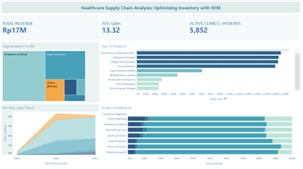

> **Strategic Supply Chain Intelligence:** Transforming raw transaction data into actionable retention strategies using RFM Segmentation and Statistical Validation (Chi-Square & Kruskal-Wallis).

---
[](https://colab.research.google.com/drive/1YxindALYaa_Ij6OLjSE3nNtg4v27_6h-#scrollTo=Gzr-LhhVJbE6)


### 📊 Interactive Dashboard

Click the image below to explore the live dashboard:


[](https://public.tableau.com/views/RFM_analysis_17700929663830/Dashboard1?:language=en-US&publish=yes&:sid=&:redirect=auth&:display_count=n&:origin=viz_share_link)


## Summary
The business was facing a "silent" crisis: despite having a large customer base, revenue was dangerously concentrated, and the churn rate of high-value clients was unknown.

Using **RFM (Recency, Frequency, Monetary) Segmentation**, this project dissected 12 months of transaction data. We moved beyond simple sales reporting to uncover **behavioral clusters**. The analysis revealed a critical dependency on a few "Champion" clients and identified a hidden loss of major wholesale partners disguised as standard churn.

**Key Impact:**
Identified **~14.1 Billion** in "At-Risk" revenue dependency, discovered a **"Hidden Unicorn"** (misclassified wholesale buyer), and proposed a bundling strategy to shift the business model from transactional (CapEx) to recurring (OpEx).

---

## Methodology

This project utilizes a rigorous analytical pipeline to ensure the results are not just descriptive, but statistically valid:

| Phase | Tools/Techniques | Description |
| :--- | :--- | :--- |
| **1. Data Processing** | **Pandas / NumPy** | Cleaning 500k+ rows, handling cancellations ('C' invoices), and outlier detection. |
| **2. Modeling** | **RFM Segmentation** | Scoring customers (1-5) based on Recency, Frequency, and Monetary quantiles. |
| **3. Profiling** | **Matplotlib / Seaborn** | visualizing distribution (Boxplots) and product preferences (Stacked Bars). |
| **4. Validation** | **Scipy (Stats)** | **Kruskal-Wallis Test** to confirm distinct segments & **Chi-Square** for product correlation. |
| **5. Strategy** | **Business Logic** | Translating stats into actionable plans (Pareto Analysis, Churn Prevention). |

---

## Key Diagnostic Findings

### 1. The "Pareto" Risk (Revenue Concentration)
The business exhibits an extreme dependency on the **'Champions'** segment.
* **Observation:** This small group contributes **~14.1 Billion** in revenue, dwarfing the 'Loyal Customers' tier (1.6 Billion).
* **Behavior:** Their *Recency* variance is near-zero (very predictable).
* **Risk Verdict:** Losing just 1-2 accounts in this tier would cause a cash flow collapse. An immediate "Red Alert" system is needed for any delay >14 days.


### 2. The "Hidden Unicorn" Discovery
An anomaly was detected in the **'Potential Loyalist'** segment (typically mid-tier).
* **Observation:** A single transaction outlier reaching **80,000 units**.
* **Insight:** This is not a regular customer testing the waters. It is a large institution (Wholesaler/Government) misclassified due to low frequency.
* **Verdict:** Immediate manual sales escalation is required to lock in this high-volume account.


### 3. Wholesale Churn in "At Risk"
The **'At Risk'** segment is not just composed of small retail drop-offs.
* **Observation:** Outliers in this churned segment show historical purchases of **>70,000 units** and values of **100k**.
* **Verdict:** The company has been bleeding major wholesale partners for ~1 year without realizing it, likely leading to significant "Dead Stock" accumulation.

### 4. The "CapEx vs. OpEx" Reality
* **Observation:** **Medical Devices** (CapEx) drive 70-88% of revenue.
* **Insight:** New customers enter via Devices, but long-term 'Champions' have a higher mix of **Consumables** (OpEx).
* **Verdict:** Retention relies on the "Razor-and-Blade" model (selling the device to sell the consumables).

---

## 💡 Strategic Recommendations

Based on the analysis, the following actions are recommended (Prioritized by Impact):

| Priority | Focus Area | Action Plan | Expected Outcome |
| :--- | :--- | :--- | :--- |
| **🚨 Urgent** | **Sales (Acquisition)** | Contact the **"Hidden Unicorn"** (80k unit buyer) immediately. | Secure a high-volume B2B contract. |
| **⚡ High** | **Retention (Champions)** | Implement **14-Day Early Warning System** (vs. std 30 days). | Prevent revenue shock from VIP churn. |
| **🔄 Medium** | **Product Strategy** | Bundle **Medical Devices** with 12-month **Consumables** contracts. | Increase CLV (Customer Lifetime Value). |
| **⚙️ Efficiency** | **Operations** | Stop manual calls to 'Lost' segment; switch to **Auto-Marketing**. | Reduce sales operational costs. |

---

## 📂 Project Structure

```text
├── 📂 assets/                  # Visualizations used in README
│   ├── monetary_dist.png       # Evidence of Pareto Risk
│   ├── quantity_dist.png       # Evidence of Hidden Unicorn
│   └── product_mix.png         # CapEx vs OpEx Analysis
│
├── 📂 data/                    # Dataset storage
│   ├── raw_data.csv            # Original dataset
│   └── rfm_segmented_data.csv  # Final dataset with clusters
│
├── 📂 notebooks/               # Analysis Core
│   └── Healthcare_Supply_Chain_RFM.ipynb  # End-to-End Analysis
│
└── 📄 README.md                # Project documentation
```
Download Full Dataset :
[https://drive.google.com/drive/folders/1CgEq7V_Mg0quhQ08HBJ9SRHA0glu0pBr?usp=drive_link]
